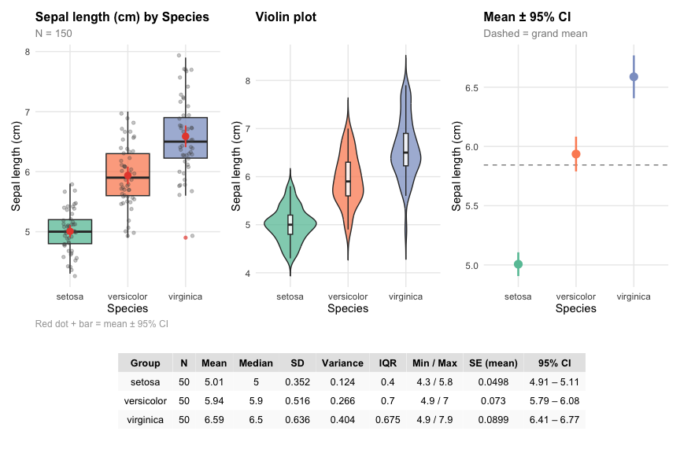

<!-- README.md is generated from README.Rmd. Please edit that file -->

# DSBtools 

<!-- badges: start -->

[](https://github.com/uham-bio/DSBtools/actions/workflows/R-CMD-check.yaml)
<!-- badges: end -->

**DSBtools** provides teaching-oriented tools for the first steps of a
data analysis in R: checking a dataset for common pitfalls, summarizing
variables, and exploring their distributions and relationships. All
functions are built around one central concept, the *scale of
measurement* (nominal, ordinal, discrete, or continuous). That is, the
scale of a variable determines which plots and statistics are
appropriate, and each function selects them automatically.

The package was developed for [Data Science
1](https://uham-bio.github.io/data-science/courses/ds1.html) and [Data
Science 2](https://uham-bio.github.io/data-science/courses/ds2.html),
the first two of four consecutive data science modules (Data Science
1–4) that are integrated into the curriculum of the BSc programs
*Biology* and *Marine Ecosystem and Fisheries Sciences* at the
University of Hamburg. In contrast to general-purpose packages for
exploratory data analysis, DSBtools deliberately explains what it does:
it reports the detected type of each variable, flags ambiguous cases
(e.g., category codes stored as numbers), and suggests how to correct
them.

## Installation

The development version can be installed from GitHub:

``` r
# install.packages("pak")
pak::pak("uham-bio/DSBtools")
```

## Functions

| Function | Purpose |
|----|----|
| `check_df()` | Checks every column of a data frame and flags common pitfalls (category codes stored as numbers, counts stored as `double`, spelling variants, numbers stored as text, outliers). |
| `describe_var()` | Summarizes one variable, optionally grouped by one or more categorical variables (`by`), as tidy tibbles. |
| `describe_df()` | Summarizes every column of a data frame in the same way. |
| `explore_var()` | Visualizes one or two variables with the appropriate plots and a statistics table. |
| `explore_df()` | Applies `explore_var()` to every column, optionally against a target variable. |
| `check_normality()` | Assesses normality with a histogram, Q-Q plot, skewness, kurtosis, and the Shapiro-Wilk test. |

## Example

``` r
library(DSBtools)

explore_var(x = iris$Species, y = iris$Sepal.Length,
            xlab = "Species", ylab = "Sepal length (cm)")
```



## Learn more

See `vignette("DSBtools")` for a complete walk-through (German version:
`vignette("DSBtools-de")`) and the help pages for all options.

## Related packages

DSBtools is part of a set of teaching resources for the *Data Science in
Biology* curriculum at the University of Hamburg:

- [DSBswirl](https://github.com/uham-bio/DSBswirl): interactive swirl
  courses for learning R step by step.
- [rquiz](https://github.com/saskiaotto/rquiz): interactive quizzes for
  R Markdown, Quarto, and Shiny.
- [UHHformats](https://github.com/uham-bio/UHHformats): R Markdown and
  Quarto templates for reports, term papers, and cheatsheets.
- [UHHthesis](https://github.com/uham-bio/UHHthesis) /
  [quarto-UHHthesis](https://github.com/uham-bio/quarto-UHHthesis):
  templates for BSc and MSc theses (as R package and as Quarto
  extension).

An overview of all UHH packages is available on the [DSB
website](https://uham-bio.github.io/data-science/).
